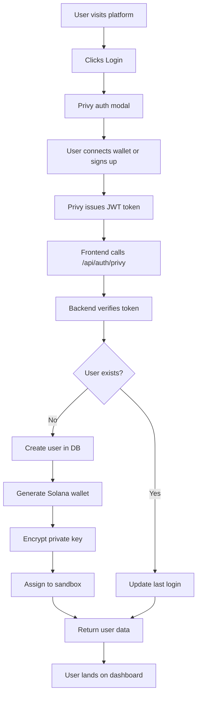
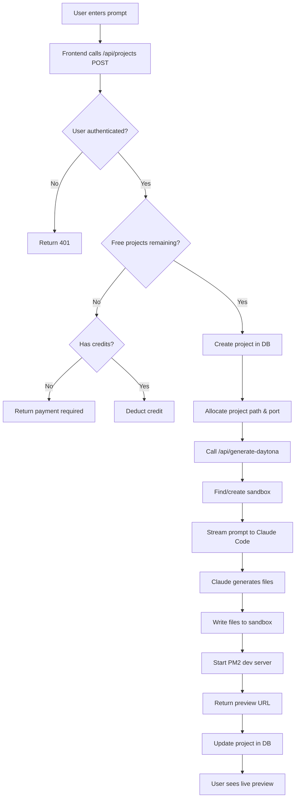
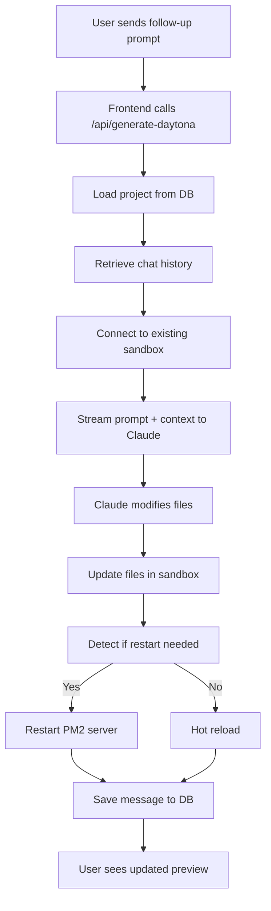
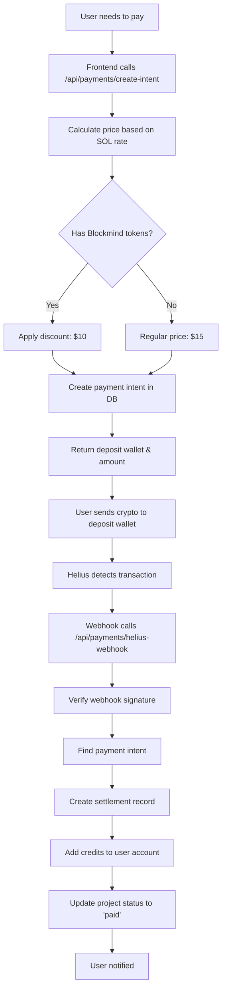
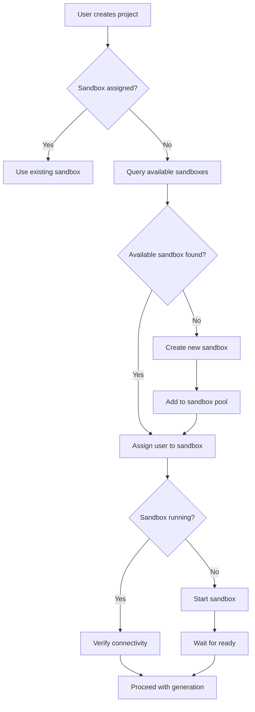

# Blockmind - Complete Project Documentation

## Table of Contents
1. [Executive Summary](#executive-summary)
2. [Product Requirements Document (PRD)](#product-requirements-document-prd)
3. [Project Overview](#project-overview)
4. [Architecture & Tech Stack](#architecture--tech-stack)
5. [Core Features](#core-features)
6. [System Workflows](#system-workflows)
7. [Database Schema](#database-schema)
8. [API Documentation](#api-documentation)
9. [Payment System](#payment-system)
10. [Security Architecture](#security-architecture)
11. [Setup & Installation](#setup--installation)
12. [Development Guide](#development-guide)
13. [Troubleshooting](#troubleshooting)

---

## Executive Summary

**Blockmind** is a next-generation AI-powered development platform that enables users to generate, modify, and deploy full-stack applications using natural language prompts. Built for the Solana ecosystem, it combines Claude Code's advanced AI capabilities with Daytona sandbox environments to provide a seamless code generation experience with live previews, real-time collaboration, and integrated crypto payments.

### Key Metrics
- **Technology**: Next.js 14, TypeScript, Supabase, Anthropic Claude Code, Daytona
- **Target Market**: Web3 developers, no-code builders, rapid prototypers
- **Business Model**: Pay-per-project (crypto payments: SOL, USDC, USDT, Blockmind Token)
- **Free Tier**: 3 free projects per user
- **Pricing**: $15/project (base), $10/project (with Blockmind token discount)

---

## Product Requirements Document (PRD)

### 1. Product Vision

**Mission Statement**: Democratize application development by enabling anyone to build production-ready web applications through natural language, powered by AI and Web3 technologies.

**Target Audience**:
- Web3 developers who want to accelerate development
- Entrepreneurs with ideas but limited coding experience
- Teams needing rapid prototyping capabilities
- Blockchain projects requiring quick MVP development

### 2. Problem Statement

**Current Pain Points**:
1. Traditional development is time-consuming and requires extensive coding knowledge
2. No-code platforms lack flexibility and customization
3. Existing AI code generators don't provide live preview and iteration capabilities
4. Web3 payment integration is complex for most platforms
5. Sandbox environments are expensive and difficult to manage

**Solution**:
Blockmind provides an AI-powered platform where users describe their application in natural language, and the system generates, deploys, and hosts the application in real-time with live previews, all paid for with cryptocurrency.

### 3. Product Goals

**Short-term Goals (MVP)**:
- ✅ AI-powered code generation using Claude Code
- ✅ Live preview in Daytona sandboxes
- ✅ Project persistence and management
- ✅ Crypto payment processing (SOL, USDC, USDT)
- ✅ User authentication via Privy
- ✅ 3 free projects per user

**Mid-term Goals (V2)**:
- Multi-language support (Python, Go, Rust beyond JavaScript/TypeScript)
- Team collaboration features
- Project templates library
- Enhanced AI capabilities (image uploads, multi-modal inputs)
- Mobile app support
- Advanced deployment options (Vercel, Netlify integration)

**Long-term Goals (V3)**:
- Marketplace for templates and components
- AI-powered debugging and optimization
- Integration with major Web3 protocols
- White-label solutions for enterprises
- Multi-chain support (Ethereum, Polygon, etc.)

### 4. Core Features & Requirements

#### 4.1 AI Code Generation
**Priority**: P0 (Critical)

**Requirements**:
- Users can input natural language prompts describing their application
- System generates complete, production-ready code using Claude Code API
- Supports iterative modifications through follow-up prompts
- Real-time streaming of generation progress
- Automatic error detection and self-healing
- Support for complex applications (multi-page, full-stack)

**Acceptance Criteria**:
- ✅ Successfully generates applications from natural language in <60 seconds
- ✅ Handles follow-up modifications without breaking existing code
- ✅ Auto-detects and fixes common build errors (>80% success rate)
- ✅ Supports streaming updates to show progress

#### 4.2 Live Preview & Sandbox Management
**Priority**: P0 (Critical)

**Requirements**:
- Each project runs in an isolated Daytona sandbox
- Live preview URL generated automatically after deployment
- Automatic server restart on code changes
- Port management (3000-3999 range for concurrent projects)
- PM2 process management for reliability
- Multi-project support within shared sandboxes (up to 5 users per sandbox)

**Acceptance Criteria**:
- ✅ Preview URL accessible within 10 seconds of generation completion
- ✅ Automatic server restart on code modifications
- ✅ No port conflicts between concurrent projects
- ✅ Sandbox auto-starts if stopped

#### 4.3 Project Management
**Priority**: P0 (Critical)

**Requirements**:
- Users can create, save, and manage multiple projects
- Project list displays all user projects with metadata
- Chat history persisted per project
- Project deletion with confirmation
- Project search and filtering
- Auto-allocation of project paths and ports

**Acceptance Criteria**:
- ✅ Projects persist across sessions
- ✅ Chat history maintained per project
- ✅ Projects accessible via unique sandbox IDs
- ✅ Seamless navigation between projects

#### 4.4 Payment & Billing System
**Priority**: P0 (Critical)

**Requirements**:
- 3 free projects per user before payment required
- Crypto payment support: SOL, USDC, USDT, Blockmind Token
- Real-time payment detection via Helius webhooks
- Automatic credit allocation after payment
- Unique deposit wallet per user
- Dynamic pricing based on current SOL/USD rate (Binance API)
- Token holder discounts (hold 1 SOL worth of Blockmind tokens = $10 vs $15)

**Acceptance Criteria**:
- ✅ Users can create 3 projects without payment
- ✅ Payment detected within 30 seconds of transaction
- ✅ Credits automatically added after payment
- ✅ Accurate SOL/USD conversion
- ✅ Discount applied correctly for token holders

#### 4.5 User Authentication & Wallet Management
**Priority**: P0 (Critical)

**Requirements**:
- Web3 authentication via Privy
- Automatic Solana wallet generation on signup
- Wallet import/export capabilities
- Encrypted private key storage (AES-256-GCM)
- Persistent user sessions
- User profile with project history

**Acceptance Criteria**:
- ✅ Seamless login experience (<5 seconds)
- ✅ Wallet generated automatically
- ✅ Users can import existing wallets
- ✅ Private keys encrypted at rest
- ✅ Users can export their wallets

#### 4.6 Code Editor & File Management
**Priority**: P1 (High)

**Requirements**:
- File explorer with tree view
- Syntax highlighting for multiple languages
- In-browser code editing
- File search across codebase
- Save file changes directly to sandbox
- View server logs and errors

**Acceptance Criteria**:
- ✅ File tree loads in <3 seconds
- ✅ Syntax highlighting for JS, TS, Python, CSS, HTML
- ✅ File edits saved successfully
- ✅ Search returns results in <2 seconds

#### 4.7 Error Handling & Auto-Healing
**Priority**: P1 (High)

**Requirements**:
- Automatic detection of build errors
- Self-healing for common issues (Turbopack CSS, import errors)
- Server log analysis
- Error suggestions to users
- Retry logic for failed operations

**Acceptance Criteria**:
- ✅ Common errors auto-fixed (>80% success rate)
- ✅ Error messages displayed clearly to users
- ✅ Server logs accessible via UI

### 5. Technical Requirements

#### 5.1 Performance
- Page load time: <3 seconds
- Code generation start: <5 seconds
- Preview URL generation: <10 seconds
- API response time: <500ms (p95)
- Sandbox startup time: <15 seconds

#### 5.2 Scalability
- Support 100+ concurrent users
- Handle 1000+ projects in database
- Sandbox pool management for cost optimization
- Horizontal scaling capability

#### 5.3 Security
- All private keys encrypted (AES-256-GCM)
- Row Level Security (RLS) on all database tables
- Admin API key authentication
- Webhook signature verification
- HTTPS-only communication
- No secrets in client-side code

#### 5.4 Reliability
- 99% uptime SLA
- Automatic error recovery
- Database backups (daily)
- Graceful degradation on API failures
- Rate limiting on sensitive endpoints

### 6. User Stories

#### As a New User
- I want to sign up quickly using my wallet so that I can start building immediately
- I want to create my first project for free so that I can test the platform
- I want to see a live preview of my application so that I can verify it works

#### As a Developer
- I want to modify my application through chat so that I can iterate quickly
- I want to view and edit code files so that I can make precise changes
- I want to see server logs so that I can debug issues

#### As a Paying User
- I want to pay with crypto (SOL/USDC/USDT) so that I can use my existing wallet
- I want to get a discount with Blockmind tokens so that I save money
- I want to see my credit balance so that I know when to top up

#### As an Admin
- I want to access user deposit wallets so that I can assist with support issues
- I want to sync webhooks automatically so that payments are detected reliably
- I want to view system metrics so that I can monitor platform health

### 7. Non-Functional Requirements

#### Usability
- Intuitive UI requiring no training
- Clear error messages and guidance
- Responsive design (desktop, tablet, mobile)
- Fast feedback on all user actions

#### Maintainability
- Comprehensive documentation
- Modular, well-structured codebase
- Environment variable management via Doppler
- Automated testing capabilities

#### Compliance
- GDPR-compliant data handling
- Secure storage of sensitive data
- Transparent pricing and billing
- Clear terms of service

### 8. Success Metrics

#### User Engagement
- Daily Active Users (DAU)
- Projects created per user
- Retention rate (30-day)
- Session duration

#### Technical Performance
- Generation success rate (>95%)
- Average generation time (<60s)
- Preview availability rate (>99%)
- API error rate (<1%)

#### Business Metrics
- Free-to-paid conversion rate (>10%)
- Average revenue per user (ARPU)
- Customer lifetime value (LTV)
- Churn rate (<5% monthly)

### 9. Risks & Mitigations

| Risk | Impact | Likelihood | Mitigation |
|------|--------|------------|------------|
| Claude API rate limits | High | Medium | Implement queue system, rate limiting, caching |
| Daytona sandbox costs | High | High | Optimize sandbox sharing, auto-shutdown idle sandboxes |
| Payment processing failures | High | Low | Helius webhook redundancy, manual verification option |
| Security breach (key theft) | Critical | Low | AES-256 encryption, regular security audits |
| Solana network downtime | Medium | Low | Fallback to devnet, cached price data |

### 10. Release Plan

#### Phase 1: MVP (Current)
- ✅ Core code generation
- ✅ Payment processing
- ✅ Project management
- ✅ User authentication

#### Phase 2: Enhancement (Q2 2025)
- 🔄 Project templates
- 🔄 Team collaboration
- 🔄 Advanced error handling
- 🔄 Mobile optimization

#### Phase 3: Scale (Q3 2025)
- ⏳ Marketplace launch
- ⏳ Enterprise features
- ⏳ Multi-chain support
- ⏳ API for developers

---

## Project Overview

### What is Blockmind?

Blockmind is an AI-powered code generation platform that bridges the gap between idea and deployment. Users describe what they want to build in plain English, and Blockmind's AI generates a complete, working application with a live preview—all in minutes.

### How It Works

1. **Describe Your Idea**: Users enter a natural language prompt (e.g., "Create a blog website with dark mode")
2. **AI Generates Code**: Claude Code generates complete application code (HTML, CSS, JavaScript, React, etc.)
3. **Instant Preview**: Application deploys to a Daytona sandbox with live URL
4. **Iterate & Refine**: Users can modify through follow-up prompts or direct code editing
5. **Pay & Continue**: After 3 free projects, users pay with crypto to continue building

### Value Proposition

**For Non-Developers**:
- Build real applications without coding knowledge
- See results immediately with live previews
- Iterate quickly through natural language

**For Developers**:
- 10x faster prototyping and MVPs
- AI-assisted development workflow
- Focus on logic, not boilerplate

**For Web3 Projects**:
- Native crypto payment integration
- Web3-friendly authentication
- Blockchain-native business model

---

## Architecture & Tech Stack

### System Architecture

```
┌─────────────────────────────────────────────────────────────┐
│                         Frontend (Next.js)                   │
│  ┌──────────────┐  ┌──────────────┐  ┌──────────────┐      │
│  │  Dashboard   │  │  Generation  │  │  Settings    │      │
│  │  (Projects)  │  │  (Chat UI)   │  │  (Wallet)    │      │
│  └──────────────┘  └──────────────┘  └──────────────┘      │
└─────────────────────────────────────────────────────────────┘
                            │
                            │ API Routes
                            ▼
┌─────────────────────────────────────────────────────────────┐
│                    Backend (Next.js API)                     │
│  ┌──────────────────────────────────────────────────────┐   │
│  │  Authentication (Privy)                              │   │
│  └──────────────────────────────────────────────────────┘   │
│  ┌──────────────────────────────────────────────────────┐   │
│  │  Code Generation (Claude Code API)                   │   │
│  └──────────────────────────────────────────────────────┘   │
│  ┌──────────────────────────────────────────────────────┐   │
│  │  Sandbox Management (Daytona SDK)                    │   │
│  └──────────────────────────────────────────────────────┘   │
│  ┌──────────────────────────────────────────────────────┐   │
│  │  Payment Processing (Helius + Solana Web3.js)        │   │
│  └──────────────────────────────────────────────────────┘   │
└─────────────────────────────────────────────────────────────┘
                            │
          ┌─────────────────┼─────────────────┐
          ▼                 ▼                 ▼
    ┌──────────┐     ┌──────────┐     ┌──────────┐
    │ Supabase │     │ Anthropic│     │  Daytona │
    │(Database)│     │  Claude  │     │(Sandboxes)│
    └──────────┘     └──────────┘     └──────────┘
          │                                  │
          │                                  │
          ▼                                  ▼
    ┌──────────┐                      ┌──────────┐
    │  Helius  │                      │  PM2 +   │
    │(Webhooks)│                      │  Next.js │
    └──────────┘                      │  Dev     │
                                      └──────────┘
```

### Technology Stack

#### Frontend
| Technology | Version | Purpose |
|------------|---------|---------|
| **Next.js** | 14.2.3 | React framework with App Router |
| **React** | 18.x | UI library |
| **TypeScript** | 5.x | Type-safe development |
| **Tailwind CSS** | 3.4.1 | Utility-first styling |
| **Lucide React** | 0.552.0 | Icon library |

#### Backend & APIs
| Service | Purpose |
|---------|---------|
| **Supabase** | PostgreSQL database + Row Level Security |
| **Anthropic Claude Code** | AI code generation (Claude 4 Sonnet) |
| **Daytona SDK** | Cloud-based development sandboxes |
| **Privy** | Web3 authentication + embedded wallets |
| **Helius** | Solana blockchain data + webhooks |
| **Solana Web3.js** | Blockchain interaction |

#### Infrastructure
| Tool | Purpose |
|------|---------|
| **Doppler** | Environment variable management |
| **PM2** | Process management in sandboxes |
| **Turbopack** | Fast Next.js bundler |
| **Binance API** | Real-time SOL/USD pricing |

#### Libraries & Utilities
```json
{
  "@anthropic-ai/claude-code": "^1.0.39",
  "@daytonaio/sdk": "^0.21.5",
  "@privy-io/react-auth": "^1.99.1",
  "@privy-io/server-auth": "^1.32.5",
  "@solana/spl-token": "^0.4.9",
  "@solana/web3.js": "^1.95.3",
  "@supabase/supabase-js": "^2.39.0",
  "bs58": "^5.0.0"
}
```

### Infrastructure Components

#### Daytona Sandboxes
- **Purpose**: Isolated development environments for each project
- **Capacity**: 5 users per sandbox (cost optimization)
- **Features**:
  - Ubuntu-based containers
  - Node.js 18+ pre-installed
  - PM2 for process management
  - Automatic port allocation (3000-3999)
  - SSH access for debugging
  - Auto-start on wake

#### Supabase Database
- **Type**: PostgreSQL with Row Level Security
- **Features**:
  - Real-time subscriptions
  - Built-in authentication (not used, Privy instead)
  - Automatic timestamps
  - Foreign key constraints
  - Indexed queries

#### Payment Infrastructure
- **Provider**: Helius (Solana RPC + Webhooks)
- **Supported Tokens**:
  - SOL (native)
  - USDC (SPL token)
  - USDT (SPL token)
  - Blockmind Token (custom SPL)
- **Flow**: User sends crypto → Helius detects → Webhook fires → Credits added

---

## Core Features

### 1. AI-Powered Code Generation

**How It Works**:
1. User enters natural language prompt
2. System streams prompt to Claude Code API
3. Claude generates file-by-file code
4. Files written to Daytona sandbox in real-time
5. Dev server starts automatically
6. Preview URL returned to user

**Key Capabilities**:
- **Multi-file generation**: Creates entire project structures
- **Streaming updates**: Real-time progress feedback
- **Error recovery**: Auto-detects and fixes common issues
- **Iterative refinement**: Maintains context across follow-ups
- **Language support**: JavaScript, TypeScript, React, HTML, CSS, Python, etc.

**Example Prompts**:
```
"Create a blog website with dark mode toggle"
"Build a todo app with drag-and-drop"
"E-commerce store with shopping cart"
"Analytics dashboard with charts"
```

### 2. Live Preview System

**Architecture**:
```
User Request → Sandbox Assignment → Code Generation → 
→ PM2 Server Start → Port Proxy → Preview URL
```

**Features**:
- Instant preview URLs (e.g., `https://sandbox-id-3000.daytona.io`)
- Automatic server restart on code changes
- Hot reload support (Turbopack)
- Multiple projects per sandbox (different ports)
- Persistent across sessions

**Port Management**:
- Range: 3000-3999 (1000 ports per sandbox)
- Allocation: Sequential with conflict detection
- Cleanup: Aggressive on project deletion

### 3. Project Management

**Database Structure**:
```sql
projects (
  id UUID,
  sandbox_id TEXT,
  user_id UUID,
  name TEXT,
  prompt TEXT,
  project_path TEXT,
  dev_port INTEGER,
  preview_url TEXT,
  status TEXT,
  created_at TIMESTAMPTZ,
  updated_at TIMESTAMPTZ
)
```

**Features**:
- Unlimited projects (after payment)
- Auto-save on every interaction
- Chat history per project
- Search and filter
- Bulk operations (future)

### 4. Code Editor & File Explorer

**Components**:
- **File Tree** (`FileTracker.tsx`): Hierarchical file browser
- **Code Viewer** (`CodeViewer.tsx`): Syntax-highlighted editor
- **File Content Viewer** (`FileContentViewer.tsx`): Read-only file display

**Features**:
- Syntax highlighting (react-syntax-highlighter)
- In-browser editing
- Search across files
- View server logs
- File upload (future)

### 5. User Authentication

**Provider**: Privy (Web3-native auth)

**Login Flow**:
```
User clicks "Login" → Privy modal → 
→ Wallet connection/email → Token issued → 
→ Backend verifies → User created in DB → 
→ Wallet generated → Sandbox assigned
```

**Features**:
- Email + wallet login
- Social login (Google, Twitter)
- Embedded wallet auto-generation
- Wallet import/export
- Session persistence

### 6. Payment & Credits System

**Pricing Model**:
- **Free Tier**: 3 projects per user
- **Base Price**: $15 per project (0.1 SOL at $150/SOL)
- **Discount**: $10 per project (with 1 SOL worth of Blockmind tokens)

**Payment Flow**:
```
User creates 4th project → Payment required → 
→ Deposit wallet shown → User sends crypto → 
→ Helius detects transaction → Webhook fires → 
→ Payment verified → Credits added → 
→ Project creation continues
```

**Credit Management**:
```sql
user_credits (
  user_id UUID,
  credits INTEGER,
  updated_at TIMESTAMPTZ
)
```

### 7. Wallet Management

**Wallet Types**:
1. **User Wallet**: Primary wallet for authentication
2. **Deposit Wallet**: Auto-generated for receiving payments

**Security**:
- Private keys encrypted with AES-256-GCM
- Only encrypted version stored in database
- Admin-only decryption for support

**Operations**:
- **Generate**: Automatic on signup
- **Import**: Users can import existing wallet
- **Export**: Users can retrieve private key
- **Balance Check**: Real-time Solana balance query

### 8. Error Handling & Auto-Healing

**Common Issues**:
1. **Turbopack CSS errors**: Auto-fix by injecting CSS config
2. **Port conflicts**: Auto-reassign available port
3. **Build failures**: Parse errors and suggest fixes
4. **Sandbox stopped**: Auto-start on access
5. **Network errors**: Retry with exponential backoff

**Auto-Healing Flow**:
```
Build Error → Parse Error Message → 
→ Identify Issue Type → Apply Fix → 
→ Restart Server → Verify Success
```

---

## System Workflows

### Workflow 1: New User Signup



### Workflow 2: Creating a Project



### Workflow 3: Modifying a Project



### Workflow 4: Payment Processing



### Workflow 5: Sandbox Management



---

## Database Schema

### Entity Relationship Diagram

```
app_users (1) ──────< (M) user_sandboxes (M) ──────> (1) sandboxes
    │
    │ (1)
    │
    v (M)
projects
    │
    │ (1)
    │
    v (M)
project_messages

app_users (1) ──────< (M) payment_intents (1) ──────< (M) payment_settlements
    │
    │ (1)
    │
    v (1)
user_credits
```

### Table Definitions

#### app_users
Stores user account information and wallet details.

```sql
CREATE TABLE app_users (
  id UUID PRIMARY KEY DEFAULT uuid_generate_v4(),
  privy_user_id TEXT UNIQUE NOT NULL,
  email TEXT,
  wallet_address TEXT UNIQUE,
  wallet_secret_key_encrypted TEXT,
  wallet_provider TEXT,
  deposit_wallet_address TEXT UNIQUE,
  deposit_wallet_secret_key_encrypted TEXT,
  sandbox_id TEXT,
  created_at TIMESTAMPTZ DEFAULT NOW(),
  updated_at TIMESTAMPTZ DEFAULT NOW()
);
```

**Key Fields**:
- `privy_user_id`: Unique Privy user identifier
- `wallet_address`: User's primary Solana wallet
- `wallet_secret_key_encrypted`: AES-256 encrypted private key
- `deposit_wallet_address`: Auto-generated wallet for receiving payments
- `sandbox_id`: Assigned Daytona sandbox

#### projects
Stores project metadata and configuration.

```sql
CREATE TABLE projects (
  id UUID PRIMARY KEY DEFAULT uuid_generate_v4(),
  sandbox_id TEXT UNIQUE NOT NULL,
  user_id UUID REFERENCES app_users(id),
  name TEXT NOT NULL,
  prompt TEXT NOT NULL,
  project_path TEXT,
  dev_port INTEGER,
  preview_url TEXT,
  status TEXT,
  last_run_at TIMESTAMPTZ,
  created_at TIMESTAMPTZ DEFAULT NOW(),
  updated_at TIMESTAMPTZ DEFAULT NOW()
);
```

**Key Fields**:
- `sandbox_id`: Links to Daytona sandbox (also used as project ID)
- `project_path`: File system path in sandbox (e.g., `/root/blockmind-projects/user-id/project-id`)
- `dev_port`: Allocated port (3000-3999)
- `status`: 'created', 'paid', 'error', etc.

#### sandboxes
Manages Daytona sandbox pool for cost optimization.

```sql
CREATE TABLE sandboxes (
  sandbox_id TEXT PRIMARY KEY,
  capacity INTEGER DEFAULT 5,
  active_users INTEGER DEFAULT 0,
  created_at TIMESTAMPTZ DEFAULT NOW(),
  updated_at TIMESTAMPTZ DEFAULT NOW(),
  last_assigned_at TIMESTAMPTZ
);
```

**Purpose**: Share sandboxes across multiple users (up to 5 per sandbox) to reduce costs.

#### user_sandboxes
Links users to their assigned sandbox.

```sql
CREATE TABLE user_sandboxes (
  id UUID PRIMARY KEY DEFAULT uuid_generate_v4(),
  app_user_id UUID REFERENCES app_users(id) ON DELETE CASCADE,
  sandbox_id TEXT REFERENCES sandboxes(sandbox_id) ON DELETE CASCADE,
  assigned_at TIMESTAMPTZ DEFAULT NOW(),
  UNIQUE (app_user_id)
);
```

#### project_messages
Stores chat history per project.

```sql
CREATE TABLE project_messages (
  id UUID PRIMARY KEY DEFAULT uuid_generate_v4(),
  project_id UUID REFERENCES projects(id) ON DELETE CASCADE,
  sandbox_id TEXT,
  message_type TEXT NOT NULL,
  content TEXT,
  sequence_number INTEGER,
  image_url TEXT,
  image_prompt TEXT,
  created_at TIMESTAMPTZ DEFAULT NOW()
);
```

**Message Types**:
- `user_message`: User's input prompt
- `claude_message`: AI's text response
- `tool_use`: Claude Code tool calls (file writes, etc.)
- `tool_result`: Results of tool execution

#### payment_intents
Tracks payment requests and status.

```sql
CREATE TABLE payment_intents (
  id UUID PRIMARY KEY DEFAULT uuid_generate_v4(),
  user_id UUID REFERENCES app_users(id),
  project_id UUID REFERENCES projects(id),
  deposit_wallet TEXT NOT NULL,
  amount_sol_lamports BIGINT NOT NULL,
  amount_usd_cents INTEGER,
  token_symbol TEXT,
  status TEXT DEFAULT 'pending',
  credits_to_grant INTEGER,
  created_at TIMESTAMPTZ DEFAULT NOW(),
  expires_at TIMESTAMPTZ
);
```

**Statuses**: `pending`, `confirmed`, `expired`, `cancelled`

#### payment_settlements
Records confirmed payment transactions.

```sql
CREATE TABLE payment_settlements (
  id UUID PRIMARY KEY DEFAULT uuid_generate_v4(),
  intent_id UUID REFERENCES payment_intents(id),
  signature TEXT UNIQUE NOT NULL,
  slot BIGINT,
  amount_raw BIGINT,
  token_symbol TEXT,
  confirmed_at TIMESTAMPTZ DEFAULT NOW()
);
```

**Purpose**: Deduplication of webhook events by `signature`.

#### user_credits
Tracks user credit balances.

```sql
CREATE TABLE user_credits (
  user_id UUID PRIMARY KEY REFERENCES app_users(id),
  credits INTEGER DEFAULT 0,
  updated_at TIMESTAMPTZ DEFAULT NOW()
);
```

**Usage**: 1 credit = 1 project creation

---

## API Documentation

### Authentication

Most endpoints require authentication via Privy JWT token.

**Header**:
```
Authorization: Bearer <privy_jwt_token>
```

**Admin Endpoints**:
```
x-admin-api-key: <admin_api_key>
```

---

### Endpoints

#### Authentication

##### POST /api/auth/privy
Authenticates user and creates account if new.

**Request**:
```json
{
  "token": "privy_jwt_token"
}
```

**Response**:
```json
{
  "user": {
    "id": "uuid",
    "privyUserId": "privy_did:...",
    "email": "user@example.com",
    "walletAddress": "ABC123...",
    "sandboxId": "sandbox-uuid"
  }
}
```

---

#### Projects

##### GET /api/projects
List all projects for authenticated user.

**Response**:
```json
{
  "projects": [
    {
      "id": "uuid",
      "sandboxId": "sandbox-uuid",
      "name": "My Blog",
      "prompt": "Create a blog website",
      "previewUrl": "https://...",
      "createdAt": "2024-01-01T00:00:00Z",
      "updatedAt": "2024-01-01T00:00:00Z"
    }
  ]
}
```

##### POST /api/projects
Create a new project.

**Request**:
```json
{
  "name": "My Blog",
  "prompt": "Create a blog website with dark mode",
  "sandboxId": "optional-existing-sandbox-id"
}
```

**Response**:
```json
{
  "project": {
    "id": "uuid",
    "sandboxId": "sandbox-uuid",
    "name": "My Blog",
    "projectPath": "/root/blockmind-projects/user-id/project-id",
    "devPort": 3000
  }
}
```

##### GET /api/projects/[sandboxId]
Get project details.

**Response**:
```json
{
  "project": {
    "id": "uuid",
    "name": "My Blog",
    "prompt": "Create a blog website",
    "previewUrl": "https://...",
    "projectPath": "/root/blockmind-projects/...",
    "devPort": 3000
  }
}
```

##### PUT /api/projects/[sandboxId]
Update project details.

**Request**:
```json
{
  "name": "Updated Name",
  "previewUrl": "https://new-url.com"
}
```

##### DELETE /api/projects/[sandboxId]
Delete a project.

**Response**:
```json
{
  "success": true,
  "message": "Project deleted"
}
```

---

#### Code Generation

##### POST /api/generate-daytona
Generate or modify code in Daytona sandbox (Server-Sent Events).

**Request**:
```json
{
  "prompt": "Create a blog website",
  "sandboxId": "optional-existing-sandbox",
  "projectPath": "/root/blockmind-projects/...",
  "devPort": 3000,
  "createOnly": false
}
```

**Response** (SSE stream):
```
data: {"type":"status","message":"Connecting to sandbox..."}

data: {"type":"file_write","file":"src/App.tsx","content":"..."}

data: {"type":"preview_url","url":"https://sandbox-3000.daytona.io"}

data: {"type":"complete"}
```

**Event Types**:
- `status`: Progress updates
- `file_write`: File being written
- `tool_use`: Claude tool invocation
- `preview_url`: Live preview URL
- `error`: Error occurred
- `complete`: Generation finished

##### POST /api/restart-server
Restart dev server in sandbox.

**Request**:
```json
{
  "sandboxId": "sandbox-uuid",
  "projectPath": "/root/blockmind-projects/...",
  "devPort": 3000
}
```

**Response**:
```json
{
  "success": true,
  "message": "Server restarted successfully"
}
```

---

#### File Operations

##### GET /api/explore-sandbox
Get file tree for a project.

**Query Params**:
- `sandboxId`: Sandbox ID
- `path`: Optional subdirectory

**Response**:
```json
{
  "files": [
    {
      "name": "src",
      "type": "directory",
      "children": [...]
    },
    {
      "name": "package.json",
      "type": "file",
      "size": 1234
    }
  ]
}
```

##### POST /api/view-file
View file contents.

**Request**:
```json
{
  "sandboxId": "sandbox-uuid",
  "filePath": "/root/blockmind-projects/.../src/App.tsx"
}
```

**Response**:
```json
{
  "content": "import React from 'react';\n...",
  "language": "typescript"
}
```

##### POST /api/save-file
Save file changes.

**Request**:
```json
{
  "sandboxId": "sandbox-uuid",
  "filePath": "/root/blockmind-projects/.../src/App.tsx",
  "content": "updated code..."
}
```

**Response**:
```json
{
  "success": true
}
```

##### POST /api/search-sandbox
Search codebase.

**Request**:
```json
{
  "sandboxId": "sandbox-uuid",
  "query": "useState",
  "path": "/root/blockmind-projects/..."
}
```

**Response**:
```json
{
  "results": [
    {
      "file": "src/App.tsx",
      "line": 5,
      "content": "const [count, setCount] = useState(0);"
    }
  ]
}
```

---

#### Payments

##### GET /api/payments/balance
Get user's credit balance and payment info.

**Response**:
```json
{
  "balance": {
    "credits": 5,
    "freeProjectsRemaining": 0
  },
  "depositWallet": "ABC123...",
  "pricing": {
    "basePrice": 1500,
    "discountPrice": 1000,
    "hasDiscount": false
  }
}
```

##### POST /api/payments/create-intent
Create payment intent.

**Request**:
```json
{
  "projectId": "optional-uuid",
  "tokenSymbol": "SOL"
}
```

**Response**:
```json
{
  "intentId": "uuid",
  "depositWallet": "ABC123...",
  "amount": {
    "solLamports": "100000000",
    "usdCents": 1500
  },
  "qrCode": "data:image/png;base64,..."
}
```

##### POST /api/payments/verify
Verify payment status.

**Request**:
```json
{
  "intentId": "uuid"
}
```

**Response**:
```json
{
  "status": "confirmed",
  "creditsGranted": 1
}
```

##### POST /api/payments/helius-webhook
Webhook for Helius payment notifications (internal).

**Headers**:
```
x-helius-webhook-secret: <webhook_secret>
```

**Request** (from Helius):
```json
{
  "type": "ACCOUNT_UPDATE",
  "nativeTransfers": [...],
  "tokenTransfers": [...],
  "signature": "tx_signature",
  "slot": 123456789
}
```

---

#### Wallet Management

##### POST /api/wallet/import
Import wallet via private key.

**Request**:
```json
{
  "privateKey": "base58_private_key"
}
```

**Response**:
```json
{
  "success": true,
  "walletAddress": "ABC123..."
}
```

##### GET /api/wallet/export
Export user's wallet private key.

**Response**:
```json
{
  "walletAddress": "ABC123...",
  "privateKey": "base58_private_key"
}
```

---

#### Admin Endpoints

##### GET /api/admin/get-private-key
Get encrypted private key for deposit wallet (admin only).

**Query Params**:
- `publicKey`: Deposit wallet address

**Headers**:
```
x-admin-api-key: <admin_api_key>
```

**Response**:
```json
{
  "success": true,
  "publicKey": "ABC123...",
  "privateKey": {
    "base58": "5Kd3NUS...",
    "array": [123, 45, 67, ...]
  },
  "userId": "uuid"
}
```

##### POST /api/admin/sync-helius-webhook
Sync all deposit wallets to Helius webhook.

**Headers**:
```
x-admin-api-key: <admin_api_key>
```

**Response**:
```json
{
  "success": true,
  "walletsAdded": 42
}
```

##### POST /api/admin/fix-user-projects
Fix user-project associations (migration tool).

**Response**:
```json
{
  "success": true,
  "projectsFixed": 15
}
```

---

## Payment System

### Overview

Blockmind uses a credit-based system with crypto payments processed on Solana.

### Pricing Structure

| Tier | Price | Tokens Supported | Discount |
|------|-------|------------------|----------|
| Free | $0 | - | 3 projects |
| Standard | $15/project | SOL, USDC, USDT | - |
| Token Holder | $10/project | All + Blockmind | 33% off |

### Payment Flow

#### 1. User Needs to Pay

When a user creates their 4th project, the system checks credits:

```typescript
const freeProjectsRemaining = Math.max(0, 3 - totalProjects);
if (freeProjectsRemaining === 0 && credits === 0) {
  return { error: "Payment required" };
}
```

#### 2. Create Payment Intent

```typescript
const pricing = await calculateProjectPrice(userWallet);
// pricing = { amountUsdCents: 1500, amountSolLamports: 100000000, hasDiscount: false }

const intent = await supabase
  .from('payment_intents')
  .insert({
    user_id: userId,
    deposit_wallet: depositWallet,
    amount_sol_lamports: pricing.amountSolLamports,
    token_symbol: 'SOL',
    status: 'pending',
    credits_to_grant: 1
  });
```

#### 3. User Sends Payment

Frontend displays:
- Deposit wallet address
- Amount to send (in SOL, USDC, USDT, or Blockmind)
- QR code for mobile wallets
- Expected USD equivalent

#### 4. Helius Detects Transaction

When user sends crypto, Helius webhook fires:

```json
{
  "type": "ACCOUNT_UPDATE",
  "nativeTransfers": [
    {
      "fromUserAccount": "UserWallet...",
      "toUserAccount": "DepositWallet...",
      "amount": 100000000
    }
  ],
  "signature": "tx_signature_123...",
  "slot": 123456789
}
```

#### 5. Payment Verified & Credited

Backend processes webhook:

```typescript
// 1. Verify webhook signature
if (req.headers['x-helius-webhook-secret'] !== HELIUS_WEBHOOK_SECRET) {
  return 401;
}

// 2. Find matching payment intent
const intent = await supabase
  .from('payment_intents')
  .select('*')
  .eq('deposit_wallet', depositWallet)
  .eq('status', 'pending')
  .single();

// 3. Create settlement record (prevents duplicates)
await supabase
  .from('payment_settlements')
  .insert({
    intent_id: intent.id,
    signature: txSignature,
    amount_raw: amount,
    token_symbol: tokenSymbol,
    confirmed_at: new Date()
  });

// 4. Add credits to user
await supabase
  .from('user_credits')
  .upsert({
    user_id: intent.user_id,
    credits: currentCredits + intent.credits_to_grant
  });

// 5. Mark intent as confirmed
await supabase
  .from('payment_intents')
  .update({ status: 'confirmed' })
  .eq('id', intent.id);
```

### Token Discount Mechanism

Users holding 1 SOL worth of Blockmind tokens get 33% discount:

```typescript
async function calculateProjectPrice(userWallet) {
  const basePriceUsdCents = 1500; // $15
  const discountPriceUsdCents = 1000; // $10
  
  // Check Blockmind token balance
  const tokenBalance = await checkBlockmindTokenDiscount(userWallet);
  
  if (tokenBalance.solEquivalent >= 1.0) {
    return { 
      amountUsdCents: discountPriceUsdCents,
      hasDiscount: true 
    };
  }
  
  return { 
    amountUsdCents: basePriceUsdCents,
    hasDiscount: false 
  };
}
```

### Price Calculation

Dynamic SOL/USD pricing via Binance API:

```typescript
async function getSolPrice(): Promise<number> {
  const response = await fetch('https://api.binance.com/api/v3/ticker/price?symbol=SOLUSDT');
  const data = await response.json();
  return parseFloat(data.price); // e.g., 150.25
}

async function convertUsdToSol(usdAmount: number): Promise<number> {
  const solPrice = await getSolPrice();
  return usdAmount / solPrice; // e.g., $15 / $150 = 0.1 SOL
}
```

### Helius Webhook Setup

#### 1. Create Webhook in Helius Dashboard

```
Webhook URL: https://your-domain.com/api/payments/helius-webhook
Type: Account Update
Transaction Types: Enhanced
Commitment Level: confirmed
```

#### 2. Dynamic Wallet Addition

When a user's deposit wallet is created, automatically add to webhook:

```typescript
async function addWalletToHeliusWebhook(walletAddress: string) {
  const response = await fetch(
    `https://api.helius.xyz/v0/webhooks/${HELIUS_WEBHOOK_ID}`,
    {
      method: 'PUT',
      headers: {
        'Authorization': `Bearer ${HELIUS_API_KEY}`
      },
      body: JSON.stringify({
        accountAddresses: [walletAddress],
        webhookType: 'enhanced',
        transactionTypes: ['ANY']
      })
    }
  );
}
```

---

## Security Architecture

### 1. Private Key Encryption

**Algorithm**: AES-256-GCM

**Implementation**:

```typescript
import crypto from 'crypto';

export function encryptPrivateKey(privateKey: string, encryptionKey: string): string {
  // Derive 32-byte key from encryption key
  const key = crypto.createHash('sha256').update(encryptionKey).digest();
  
  // Generate random IV
  const iv = crypto.randomBytes(16);
  
  // Create cipher
  const cipher = crypto.createCipheriv('aes-256-gcm', key, iv);
  
  // Encrypt
  let encrypted = cipher.update(privateKey, 'utf8', 'base64');
  encrypted += cipher.final('base64');
  
  // Get auth tag
  const authTag = cipher.getAuthTag();
  
  // Combine: iv:encrypted:authTag
  return `${iv.toString('base64')}:${encrypted}:${authTag.toString('base64')}`;
}

export function decryptPrivateKey(encryptedData: string, encryptionKey: string): string {
  const [ivBase64, encrypted, authTagBase64] = encryptedData.split(':');
  
  const key = crypto.createHash('sha256').update(encryptionKey).digest();
  const iv = Buffer.from(ivBase64, 'base64');
  const authTag = Buffer.from(authTagBase64, 'base64');
  
  const decipher = crypto.createDecipheriv('aes-256-gcm', key, iv);
  decipher.setAuthTag(authTag);
  
  let decrypted = decipher.update(encrypted, 'base64', 'utf8');
  decrypted += decipher.final('utf8');
  
  return decrypted;
}
```

**Storage**:
- Only encrypted version stored in `app_users.wallet_secret_key_encrypted`
- Encryption key stored in Doppler (never in code)
- Admin-only decryption for support purposes

### 2. Row Level Security (RLS)

All Supabase tables have RLS enabled:

```sql
-- Enable RLS
ALTER TABLE projects ENABLE ROW LEVEL SECURITY;

-- Policy: Users can only read their own projects
CREATE POLICY "projects_select" ON projects
  FOR SELECT
  USING (user_id = auth.uid());

-- Policy: Users can only insert projects with their own user_id
CREATE POLICY "projects_insert" ON projects
  FOR INSERT
  WITH CHECK (user_id = auth.uid());
```

**Current Setup**: Permissive policies for service role, enforced at application level.

**Future**: Integrate Supabase Auth for automatic RLS based on JWT claims.

### 3. Authentication & Authorization

#### Privy Token Verification

```typescript
import { PrivyClient } from '@privy-io/server-auth';

const privy = new PrivyClient(
  process.env.NEXT_PUBLIC_PRIVY_APP_ID!,
  process.env.PRIVY_APP_SECRET!
);

export async function verifyPrivyToken(token: string) {
  try {
    const claims = await privy.verifyAuthToken(token);
    return {
      userId: claims.userId,
      isValid: true
    };
  } catch (error) {
    return { isValid: false };
  }
}
```

#### Admin API Key Protection

```typescript
export function requireAdminAuth(req: NextRequest) {
  const apiKey = req.headers.get('x-admin-api-key');
  
  if (!apiKey || apiKey !== process.env.ADMIN_API_KEY) {
    throw new Error('Unauthorized - Admin access required');
  }
}
```

### 4. Webhook Signature Verification

```typescript
export function verifyHeliusWebhook(req: NextRequest): boolean {
  const signature = req.headers.get('x-helius-webhook-secret');
  return signature === process.env.HELIUS_WEBHOOK_SECRET;
}
```

### 5. Environment Variable Security

**Doppler Configuration**:
- All secrets stored in Doppler
- Never committed to git
- Auto-injected at runtime
- Separate configs for dev/staging/prod

**Secret Types**:
| Type | Example | Exposure |
|------|---------|----------|
| Public | `NEXT_PUBLIC_SUPABASE_URL` | Client-safe |
| Private | `ANTHROPIC_API_KEY` | Server-only |
| Critical | `ENCRYPTION_KEY` | Admin-only |

### 6. Attack Vector Mitigations

#### SQL Injection
- ✅ Supabase client uses parameterized queries
- ✅ All user inputs sanitized

#### XSS (Cross-Site Scripting)
- ✅ React automatically escapes JSX
- ✅ No `dangerouslySetInnerHTML` used
- ✅ Content Security Policy headers (future)

#### CSRF (Cross-Site Request Forgery)
- ✅ SameSite cookie attribute
- ✅ Origin header validation
- ✅ JWT tokens (stateless)

#### Rate Limiting
- ⚠️ Not implemented (future)
- Recommended: 10 requests/minute per user for generation

#### DDoS Protection
- ⚠️ Relies on Vercel/hosting provider
- Future: Cloudflare integration

---

## Setup & Installation

### Prerequisites

- Node.js 18+ and npm
- Git
- Doppler CLI
- Accounts:
  - Supabase (database)
  - Anthropic (Claude Code API)
  - Daytona (sandbox environments)
  - Privy (authentication)
  - Helius (Solana webhooks)

### Step 1: Clone Repository

```bash
git clone <repository-url>
cd blockmind
```

### Step 2: Install Doppler CLI

**Windows (PowerShell)**:
```powershell
scoop install doppler
```

**macOS**:
```bash
brew install doppler
```

**Linux**:
```bash
curl -Ls --tlsv1.2 --proto "=https" --retry 3 https://cli.doppler.com/install.sh | sh
```

### Step 3: Configure Doppler

```bash
# Login
doppler login

# Setup project
doppler setup

# Set environment variables
doppler secrets set NEXT_PUBLIC_SUPABASE_URL="https://your-project.supabase.co"
doppler secrets set NEXT_PUBLIC_SUPABASE_ANON_KEY="your-anon-key"
doppler secrets set SUPABASE_SERVICE_ROLE_KEY="your-service-role-key"
doppler secrets set ANTHROPIC_API_KEY="sk-ant-api03-your-key"
doppler secrets set DAYTONA_API_KEY="your-daytona-api-key"
doppler secrets set NEXT_PUBLIC_PRIVY_APP_ID="your-privy-app-id"
doppler secrets set PRIVY_APP_SECRET="your-privy-app-secret"
doppler secrets set HELIUS_API_KEY="your-helius-api-key"
doppler secrets set HELIUS_WEBHOOK_ID="your-webhook-id"
doppler secrets set HELIUS_WEBHOOK_SECRET="$(openssl rand -base64 32)"
doppler secrets set ENCRYPTION_KEY="$(openssl rand -hex 32)"
doppler secrets set ADMIN_API_KEY="$(openssl rand -base64 32)"
```

See `blockmind-ui/DOPPLER_ENV_VARS.md` for complete list.

### Step 4: Setup Supabase Database

1. Create Supabase project at https://app.supabase.com
2. Run schema in SQL Editor:

```bash
# Copy schema to clipboard
cat blockmind-ui/supabase-schema-complete.sql

# Or use Supabase CLI
supabase db push
```

### Step 5: Configure Helius Webhook

1. Go to https://dashboard.helius.dev
2. Create webhook:
   - URL: `https://your-domain.com/api/payments/helius-webhook`
   - Type: Account Update
   - Commitment: confirmed
3. Copy webhook ID and set in Doppler:

```bash
doppler secrets set HELIUS_WEBHOOK_ID="your-webhook-id"
```

### Step 6: Install Dependencies

```bash
cd blockmind-ui
npm install
```

**Windows Users**: If native module errors occur:
```bash
npm run install:win
```

### Step 7: Run Development Server

```bash
npm run dev
```

Application available at `http://localhost:3000`.

### Step 8: Test Setup

#### Test Authentication
1. Click "Login" → connect wallet
2. Check console for user creation logs
3. Verify user in Supabase `app_users` table

#### Test Code Generation
1. Enter prompt: "Create a todo app"
2. Wait for generation (~30-60 seconds)
3. Click preview URL to see live app
4. Verify project in `projects` table

#### Test Payments (Devnet)
1. Create 4th project
2. Payment screen should appear
3. Send devnet SOL to deposit wallet
4. Verify payment detected within 30 seconds

---

## Development Guide

### Project Structure

```
blockmind-ui/
├── app/
│   ├── api/                    # API routes
│   │   ├── admin/              # Admin endpoints
│   │   ├── auth/               # Authentication
│   │   ├── generate-daytona/   # Code generation
│   │   ├── payments/           # Payment processing
│   │   ├── projects/           # Project management
│   │   └── ...
│   ├── generate/               # Main generation UI
│   ├── page.tsx                # Dashboard
│   ├── layout.tsx              # Root layout
│   └── globals.css             # Global styles
├── components/                 # React components
│   ├── Navbar.tsx
│   ├── CodeViewer.tsx
│   ├── FileTracker.tsx
│   └── ...
├── lib/                        # Utility libraries
│   ├── supabase.ts
│   ├── daytona-utils.ts
│   ├── solana-payments.ts
│   ├── encryption.ts
│   └── ...
├── scripts/                    # Utility scripts
│   ├── generate-in-daytona.ts  # Main generation script
│   ├── diagnose-sandbox.ts
│   └── ...
├── utils/                      # Helper utilities
│   └── projectStorage.ts
├── public/                     # Static assets
├── package.json
├── tsconfig.json
└── tailwind.config.ts
```

### Development Workflow

#### 1. Local Development

```bash
# Start dev server with Doppler
npm run dev

# Start without Doppler (uses .env.local)
npm run dev:local

# Run linter
npm run lint

# Build for production
npm run build
```

#### 2. Testing Changes

**API Routes**:
```bash
# Test endpoint with curl
curl -X POST http://localhost:3000/api/projects \
  -H "Authorization: Bearer <token>" \
  -H "Content-Type: application/json" \
  -d '{"name":"Test","prompt":"Create a test app"}'
```

**Database Changes**:
```bash
# Apply schema changes
supabase db push

# Reset database (dev only)
supabase db reset
```

**Sandbox Testing**:
```bash
# Test Daytona connection
npx tsx scripts/test-daytona-connection.ts

# Diagnose sandbox issues
npx tsx scripts/diagnose-sandbox.ts <sandbox-id>
```

#### 3. Adding New Features

**Example: Add New API Endpoint**

1. Create file: `app/api/my-feature/route.ts`

```typescript
import { NextRequest, NextResponse } from 'next/server';
import { verifyPrivyToken } from '@/lib/privy';
import { supabaseAdmin } from '@/lib/supabase';

export async function POST(req: NextRequest) {
  try {
    // 1. Authenticate user
    const token = req.headers.get('authorization')?.replace('Bearer ', '');
    if (!token) {
      return NextResponse.json({ error: 'Unauthorized' }, { status: 401 });
    }
    
    const { userId } = await verifyPrivyToken(token);
    
    // 2. Get user from database
    const { data: user } = await supabaseAdmin
      .from('app_users')
      .select('*')
      .eq('privy_user_id', userId)
      .single();
    
    // 3. Your feature logic
    const { data } = await req.json();
    // ... process data ...
    
    // 4. Return response
    return NextResponse.json({ success: true, data });
  } catch (error: any) {
    console.error('Error:', error);
    return NextResponse.json(
      { error: error.message || 'Internal error' },
      { status: 500 }
    );
  }
}
```

2. Add frontend call:

```typescript
async function callMyFeature(data: any) {
  const token = await getAccessToken();
  const response = await fetch('/api/my-feature', {
    method: 'POST',
    headers: {
      'Authorization': `Bearer ${token}`,
      'Content-Type': 'application/json'
    },
    body: JSON.stringify(data)
  });
  return response.json();
}
```

### Code Style Guidelines

#### TypeScript
- Use strict mode
- Prefer `async/await` over `.then()`
- Use type annotations for function parameters
- Avoid `any` unless necessary

#### React
- Use functional components with hooks
- Prefer `useState` and `useEffect`
- Extract reusable logic into custom hooks
- Use proper dependency arrays

#### API Routes
- Always validate inputs
- Use try-catch for error handling
- Return consistent response formats
- Log errors with context

#### Database
- Use parameterized queries (Supabase client handles this)
- Always check for null/undefined
- Use transactions for multi-step operations
- Add indexes for frequently queried fields

### Testing

#### Manual Testing Checklist

**Authentication**:
- [ ] Login with new account
- [ ] Login with existing account
- [ ] Logout and login again
- [ ] Session persists across page refresh

**Project Creation**:
- [ ] Create first project (free)
- [ ] Create second and third project
- [ ] Fourth project requires payment
- [ ] Project appears in dashboard

**Code Generation**:
- [ ] Simple prompt generates successfully
- [ ] Complex prompt (multi-page app) works
- [ ] Follow-up modifications preserve existing code
- [ ] Error messages displayed clearly

**Preview**:
- [ ] Preview URL accessible
- [ ] Preview updates after modifications
- [ ] Server restarts automatically
- [ ] Multiple projects have unique ports

**Payments**:
- [ ] Payment intent created
- [ ] QR code displays correctly
- [ ] Payment detected within 30 seconds
- [ ] Credits added after payment
- [ ] Can create project after payment

**File Operations**:
- [ ] File tree loads correctly
- [ ] Can view file contents
- [ ] Can edit and save files
- [ ] Search returns correct results

---

## Troubleshooting

### Common Issues

#### 1. Preview Not Loading

**Symptoms**: Preview URL returns 404 or connection refused.

**Possible Causes**:
- Dev server not started
- Wrong port number
- Sandbox stopped
- PM2 process crashed

**Solutions**:

```bash
# Check if server is running
# In sandbox terminal (via Daytona):
pm2 list

# If not running, start it:
pm2 start npm --name "project-3000" -- run dev -- --port 3000

# Check logs:
pm2 logs project-3000

# Restart from UI:
# Code tab → View Logs → Restart Server button
```

#### 2. Build Errors

**Symptoms**: Generation completes but preview shows error page.

**Common Errors**:

**Turbopack CSS Issue**:
```
Error: CSS @import is not supported in Turbopack
```

**Fix**: Auto-fixed by system. If persists:
```bash
npx tsx scripts/fix-turbopack-issue.ts <sandbox-id> <project-path>
```

**Import Errors**:
```
Error: Module not found: Can't resolve 'package-name'
```

**Fix**: Ensure `package.json` includes dependency, then:
```bash
cd /root/blockmind-projects/user-id/project-id
npm install
pm2 restart project-3000
```

#### 3. Port Conflicts

**Symptoms**: Error message "Port 3000 already in use".

**Solutions**:

```bash
# Kill process on port:
lsof -ti:3000 | xargs kill -9

# Or use PM2:
pm2 delete project-3000
pm2 start npm --name "project-3000" -- run dev -- --port 3000
```

**System Auto-Fix**: Restart server endpoint includes aggressive cleanup.

#### 4. Payment Not Detected

**Symptoms**: Sent crypto but credits not added.

**Checks**:

1. **Verify transaction on Solscan**:
   ```
   https://solscan.io/tx/<signature>
   ```

2. **Check webhook logs**:
   - Helius Dashboard → Webhooks → Logs
   - Look for recent events

3. **Verify deposit wallet**:
   ```bash
   curl "https://api.mainnet-beta.solana.com" \
     -X POST \
     -H "Content-Type: application/json" \
     -d '{"jsonrpc":"2.0","id":1,"method":"getBalance","params":["<deposit_wallet>"]}'
   ```

4. **Manual credit addition** (admin):
   ```sql
   UPDATE user_credits
   SET credits = credits + 1
   WHERE user_id = '<user_id>';
   ```

#### 5. Sandbox Connection Errors

**Symptoms**: "502 Bad Gateway" or "Sandbox not accessible".

**Causes**:
- Daytona API temporarily down
- Sandbox stopped
- Network issues

**Solutions**:

```bash
# Test Daytona connection:
npx tsx scripts/test-daytona-connection.ts

# Diagnose specific sandbox:
npx tsx scripts/diagnose-sandbox.ts <sandbox-id>

# System auto-retries with exponential backoff
# Check lib/daytona-utils.ts for retry logic
```

#### 6. Authentication Issues

**Symptoms**: "Unauthorized" errors or login loop.

**Solutions**:

1. **Clear browser cache and cookies**
2. **Verify Privy configuration**:
   ```bash
   doppler secrets get NEXT_PUBLIC_PRIVY_APP_ID
   doppler secrets get PRIVY_APP_SECRET
   ```
3. **Check Privy dashboard** for errors
4. **Verify user in database**:
   ```sql
   SELECT * FROM app_users WHERE privy_user_id = '<privy_user_id>';
   ```

### Debugging Tips

#### Enable Verbose Logging

Add to `generate-in-daytona.ts`:
```typescript
const DEBUG = true;

if (DEBUG) {
  console.log('[DEBUG] Sandbox ID:', sandboxId);
  console.log('[DEBUG] Project path:', projectPath);
  console.log('[DEBUG] Prompt:', prompt);
}
```

#### Inspect Database

```sql
-- Check user's projects
SELECT * FROM projects WHERE user_id = '<user_id>';

-- Check payment intents
SELECT * FROM payment_intents WHERE user_id = '<user_id>' ORDER BY created_at DESC;

-- Check credit balance
SELECT * FROM user_credits WHERE user_id = '<user_id>';

-- Check sandbox assignments
SELECT 
  u.email,
  us.sandbox_id,
  s.active_users
FROM app_users u
JOIN user_sandboxes us ON u.id = us.app_user_id
JOIN sandboxes s ON us.sandbox_id = s.sandbox_id
WHERE u.id = '<user_id>';
```

#### Monitor Sandbox

```bash
# SSH into sandbox (if access available)
ssh sandbox-id@daytona.io

# Check running processes
pm2 status

# View logs
pm2 logs --lines 100

# Check disk space
df -h

# Check network
curl localhost:3000
```

### Performance Optimization

#### 1. Reduce Generation Time
- Use smaller context prompts
- Limit number of files Claude generates at once
- Cache frequently used templates

#### 2. Optimize Database Queries
- Add indexes on frequently queried columns
- Use `.select()` to fetch only needed columns
- Implement pagination for large result sets

#### 3. Reduce Sandbox Costs
- Increase users per sandbox (currently 5, can go higher)
- Implement auto-shutdown for idle sandboxes
- Use smaller sandbox sizes for simple projects

---

## Conclusion

Blockmind represents a new paradigm in application development: natural language to production-ready code in minutes. By combining cutting-edge AI (Claude Code), cloud sandboxes (Daytona), and crypto payments (Solana), we've created a platform that's accessible, powerful, and aligned with Web3 principles.

### Next Steps

1. **Scale**: Optimize sandbox sharing and API usage
2. **Enhance**: Add templates, team collaboration, and advanced features
3. **Expand**: Support more languages, frameworks, and deployment options
4. **Monetize**: Grow user base and optimize pricing

### Resources

- **Documentation**: This file + individual `.md` files in `blockmind-ui/`
- **Support**: [Add support channel]
- **Community**: [Add Discord/Telegram]
- **GitHub**: [Add repository link]

---

**Last Updated**: November 7, 2024  
**Version**: 1.0.0  
**Maintained by**: Blockmind Team

---

*Built with ❤️ for the Solana ecosystem*

